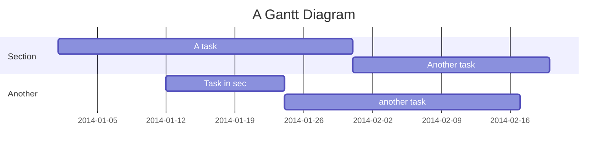

# JavaScript Notes

---
  - [1. `+` operator](#1--operator)
  - [2. `-` operator](#2---operator)
  - [3. falsy values](#3-falsy-values)
  - [4. Number('foo') return NaN](#4-numberfoo-return-nan)
  - [5. Comparison operators](#5-comparison-operators)
  - [6. Array is not a separate type. It is made from Object type](#6-array-is-not-a-separate-type-it-is-made-from-object-type)
  - [7. Conditional operator](#7-conditional-operator)
  - [8. Defining function](#8-defining-function)
  - [9. Looping](#9-looping)
  - [10. Array operations](#10-array-operations)
  - [11. Runtime in the browser](#11-runtime-in-the-browser)
  - [12. Execution Context](#12-execution-context)
  - [13. Scope chain](#13-scope-chain)
  - [14. Hoisting](#14-hoisting)
  - [15. This keyword](#15-this-keyword)
  - [16. Regular function vs Arrow function](#16-regular-function-vs-arrow-function)
  - [17. Primitives and Objects](#17-primitives-and-objects)
  - [18. More on functions](#18-more-on-functions)
  - [19. Destructuring](#19-destructuring)
  - [20. Spread operator](#20-spread-operator)
  - [21. Rest pattern and parameters](#21-rest-pattern-and-parameters)
  - [22. Basic DOM manipulation](#22-basic-dom-manipulation)

#### 1. `+` operator

When we use `+` operator with string and number javascript will automatically convert the number to string this is called - coercion - automatic type conversion.

```javascript
> '35' + 3
'353'

> 35 + 3
38
```
 #### 2. `-` operator 
Interestingly if we use `-` operator with strings javascript automatically convert them to numbers. Somehow the opposite of + operator.

```javascript
> '4' - '3'
1
> '4' - 3
1
```
#### 3. falsy values
- undefined
- NaN
- 0
- ""
- null

Be aware that empty Object, Map, Array, etc do not return false but true.  
```javascript
> Boolean({})
true
> Boolean([])
true
```
#### 4. Number('foo') return NaN

#### 5. Comparison operators
`===` strict comparison no coercion.  
`==` loose comparison - unpredictable result, avoid this.

#### 6. Array is not a separate type. It is made from Object type
```javascript#### 9. Looping
Also be aware of that typeof null return object (legacy bug)
```javascript
> typeof null
'object'
```

#### 7. Conditional operator
```javascript
> let age = 15
undefined
> age >= 18 ? 'wine': 'water'
'water'
```

#### 8. Defining function
There are 3 ways to define function:
- function statement  
```javascript
function foo() {}
```
- function expression  
```javascript
const foo = function () {}
```
- arrow function expression (no this keyword)
```javascript
const foo = () => expr or {}
```

#### 9. Looping

- `for` `of` loop - looping iterables (String, Array, Map,  Set)
```javascript
> for (const elem of [2, 4, 5]) console.log(elem) 
2
4
5
> for (let f of 'foo') console.log(f)
f
o
o
```
If you want to loop with index use entries property for example: `for const [i, el] of [2, 4, 5].entries() ....`

- `forEach` method - executes a provided function once for each array element. Exists for Array, Map, Set.
```javascript
> [1, 3, 5].forEach((el, i, arr) => console.log(i, el))
0 1
1 3
2 5
```

- Looping objects
```javascript
> let foo = {a: 1 , b: 2}
> for (const [key, value] of Object.entries(foo)) console.log(key, value)
a 1
b 2
```
For keys or values only use `Object.keys()` or `Object.values()`


#### 10. Array operations

- methods mutating original array in place - `pop`, `push`
```javascript
> const foo = [ 4, 6 ]
// Adds one or more elements to the end of an array, and returns the new length of the array.
> foo.push(7, 8)
4
> foo
[ 4, 6, 7, 9 ]
// Removes the last element from an array and returns that element.
> foo.pop()
9
> foo
[4, 6, 7]

// shift (remove), unshift array methods are analogical to pop and push but for the begging of the array.
// Also there is splice(start, deleteCount, item1, item2, itemN) method - Adds and/or removes elements from an array.
// reverse and sort also change in place.
```
 - methods returning new array - `slice`, `concat`

```javascript
// Extracts a section of the calling array and returns a new array.
foo.slice(1)
[ 6, 7 ]
foo.slice(-1)
[7]

// concat returns a new array that is the calling array joined with other array(s) and/or value(s).
foo.concat([10, 11])
[ 4, 6, 7, 10, 11 ]

// Also this can be used with the same result
> [...foo, ...[10, 11]]
[ 4, 6, 7, 10, 11 ]

// Also map and filter methods are in this category.
> foo.map((el, i, arr) => el + 10)
[ 14, 16, 17 ]
```

- Check if an array contains a certain item - `includes`
```javascript
> foo.includes(8)
false
> foo.includes(7)
true
```
- Joins all elements of an array into a string - `join`.
- `reduce` - Executes a user-supplied "reducer" callback function on each element of the array (from left to right), to reduce it to a single value. `reduce(callbackFn, initialValue)`  A common practice is method chaining for example we can chain `filter`,  `map`, `reduce`
```javascript
> bar.filter(el => el > 0).map(el => el * 3).reduce((acc, el) => acc + el)
21
```
- creating arrays
  - `Array.from`- Creates a new Array instance from an array-like (objects with a length property and indexed elements) object or iterable object.
    ```javascript
      > Array.from('opa')
      [ 'o', 'p', 'a' ]
      > Array.from({ length: 3}, () => 'bar')
      [ 'bar', 'bar', 'bar' ]
    ```
  - `new Array(element0, element1, /* ... ,*/ elementN)` - using constructor, be aware of `new Array(arrayLength)`
 
#### 11. Runtime in the browser
It contains:
- javascript engine - program that executes javascript code contain call stack (where the code actually executed using execution context) and heap (unstructured memory pull contains all the objects)
- web APIs - DOM, Fetch API, Timers, etc. Not the part of the language itself. JS get access to this APIs through the global window object
- callback queue - contains all callback function that are ready to be executed, for example callback function from DOM event listener.
  
#### 12. Execution Context
Every function is executed in the call stack having execution context abstraction which contains:
- variable environment
    - `var`, `let`, `const` variables - all variables declared inside the function
    - Functions
    - argument object - contains function arguments
- chain scope - references to the variables that are located to the outside of the current function
- this keyword

Execution context is generated during "creating face" just before execution.

Important detail is that arrow functions do not have their own argument object and this keyword!

Call stack is actually execution contexts get stacked on top of each other to keep track of where are in the execution.

#### 13. Scope chain

Every function has scope chain - every outer parent function and finally the global scope.  
`let` and `const` variables are block scoped but `var` variables are not block scoped.
We can override variables accessed in function and declared somewhere in scope chain outside of the function.  
<sub><sup>
That's differ from python for example where we have to use `global` or `nonlocal`  in order to override variable created outside of the function.
</sub></sup>

#### 14 Hoisting

Makes some types of variables accessible/usable in the code before they are actually declared. "Variables lifted to the top of their scope". Because the code is parsed for variables and function statement before executing.

- function statement can be declared after calling them.
- `var` variable can used before declaring them but they will be undefined. That leads to a lot of bugs. Declaring variable with `var` should be avoided!
- `let` and `const` they are also use hoisting but also they go TDZ (Temporal Dead Zone) until declaration line of the variable is reached. If the variable is in TDZ error is raise different error from undeclared variable at all.
  
`const` variables work thanks to the TDZ

#### 15 This keyword
Special variable that is created for every execution context (every function). Takes the value of (points to) the owner of the function in which the `this` keyword is used. It is **NOT** static. It depends on how the function is called and its value is assigned when the function is actually called.  
Here are 4 different ways in which function can be called:
- as a method in that case `this` points to the object
```javascript
> const Joe = {
...   birthYear: 1983,
...   getAge: function () {
.....     return 2040 - this.birthYear;
.....   },
... };
> 
> console.log(Joe.getAge());
57

> const Maria = {
...   birthYear: 1999,
... };
> Maria.getAge = Joe.getAge;
> // this keyword always point to the object that calls the method
> console.log(Maria.getAge());
41
```
- simple function call - `this` will be window object but if strict mode is used `this` will be undefined 
- arrow function do not have their own `this` keyword and through out of the scope chain you will access `this` of parent scope.
```javascript
//we use strict mode
> function foo () {console.log(this)}
> foo()
undefined

> const bar = () => console.log(this)
> bar()
Object [global] {
  global: [Circular],
  ...}
```
In the second case a long global object is return since arrow function has no own this keyword and therefore we access this from global scope which points to global object
- event listener - `this` = DOM element that the handler is attached to

#### 16. Regular function vs Arrow function
Arrow function do not have their own `this` keyword. So if we use arrow function in object and use this inside this function we will access `this` of the parent scope
```javascript
> const Joe = {
...   birthYear: 1983,
...   getAge: () => {
.....     return 2040 - this.birthYear;
.....   },
... };
> Joe.getAge();
NaN
```
Yes, pretty unexpected result. We try to access `this` in  `Joe.getAge` but since this is an arrow function no dedicated `this` keyword is created. So through out the scope chain the next environment scope is the global scope where `this` is defined and point to global object.

Another case where if we defined method and within defined function and call it within the method `this` keyword will be undefined in strict mode because it is a simple function call no object is attached here.
```javascript
> const Joe = {
...   birthYear: 1983,
... 
...   outer: function () {
...     function inner() {
.....       console.log('in the inner');
.....       console.log('this: ' + this);
.....     }
...     inner();
...   },
... };
> Joe.outer();
in the inner
this: undefined
```

If we want in inner function `this` to point to the object Joe we can use arrow function since `this` will point to `this` of the parent scope which is the outer function.

```javascript
> const Joe = {
...   birthYear: 1983,
... 
...   outer: function () {
...     const inner = () => {
.....       console.log('in the inner');
.....       console.log('this is: ' + this);
.....     };
...     inner();
...   },
... };
> Joe.outer();
in the inner
this is: [object Object]
```
Here `this` point to Joe

Other option is:
```javascript
...
  outer: function () {
    self = this;
    function inner() {
      // here we can use self which point ot the outer this
...
```

#### 17. Primitives and Objects
primitives:
- Number
- String
- Boolean
- Undefined
- Null
- Symbol
- BigInt  

Object types (live in the heap) also called reference types:
- Object literal
- Arrays
- Function
- etc

Object types are stored in the memory heap whereas primitive types are stored in the call stack in the execution context. If we have this `let foo = {bar: 5}` that means 
foo point to address in the stack which value is another address point to the address of the object in the heap. If we do this `let ror = foo` that means that new variable is created in the stack which point to the same object in the heap. That's why if we write `roo.bar = 3` `console.log(foo.bar)` will print 3. Since we change the same object with two references pointed to him. Objects are mutable.

Function arguments are passed by value similar as assigning value to a variable if we have the following snippet
```javascript
function example (param1) {.....}

let foo = 'bar'

example(foo)
```
Calling `example` func create a new copy of `foo`. This means in the call stack will have identifier `foo` pointing to address in the stack which address holds the value `bar` and another identifier `param1` pointing to another address in the stack holding the same value `bar`. That means **changing `param1` inside the function will NOT affect `foo` in anyway**, This would happened if it was passed by reference.  
**BUT** this is the case with primitive types if we have **`let foo = {age: 30}`**  we pass an object type which lives in the heap therefore `param1` holds in the stack not the actual object but an address which leads to the heap where the object lives. **That means that changes (for example: `param1.age = 50`) to that object inside the function throughout the `param1` will be visible throughout the `foo` since it is the same object**. Actually this objected is pointed by two different places in the stack(`foo` and `param1`).  
<sub><sup>
In python is similar but every type lives in the heap even string type. Everything is object and the address of the object can be got by `id` function. But string for example are immutable. They intentionally are not allowed to be updated in place. Some other immutable objects are integer, float, tuple, and bool. Of course Dict, List, Set are mutable.
</sub></sup>  
Above can help to explain why objects are not equal in the following snippet.
```javascript
> let obj1 = {foo: 3}
> let obj2 = {foo: 3}
> obj1 === obj2 // compare object addresses in the heap not the actual data in that case
false
```

#### 18 More on functions

Functions are first class citizen which means that they can be passed as arguments to a function and function can return function. They are also objects therefore they have methods:
- call - the first argument replace this.
- apply - same as call but we pass array after first argument but not used so much today because of the spread `...` operator.
- bind - return function with embedded `this` provided as first argument when bind is called. Same as partial update in Python but also the first argument replace this.
```javascript
const module = {
  x: 42,
  getX: function() {
    return this.x;
  }
};

const unboundGetX = module.getX;
console.log(unboundGetX()); // The function gets invoked at the global scope
// expected output: undefined

const boundGetX = unboundGetX.bind(module);
console.log(boundGetX());
// expected output: 42
```

You can provide default values for function parameters during declaration but when you call the function you cannot provide argument names like in Python for example so you have to rely on the order of the parameters. But deconstructing feature can be used for that purpose.
#### 19 Destructuring
- destructing arrays
```javascript
> let [x, y, z] = ["1", "2", "3"];
> x
'1'
> y
'2'
> z
'3'

> let [, , bar] = ["1", "2", "3"];
> bar
'3'

> let [one, [, three]] = [1, [2, 3]]
> three
3

> let [foo1] = [1, 2]
> foo1
1

> let [bar1, bar2, bar3] = [1, 2]
> bar1
1
> bar2
2
> bar3
undefined

// default values
> let [kr = 1] = []
> kr
1

> function example() {return [1, 2]}
> let [q, v] = example()
> q
1
> v
2
```
- destructuring objects
```javascript
> let {a, b: new_name, c} = {a:1, b:2}
> a
1
> new_name
2
> c
undefined

> let {foo, bar = 'default_value'} = {foo:1}
> foo
1
> bar
'default_value'

// nested with array and objects
> let [{items: [{item_id}]}] = [{order_id: 3, items: [{item_id: 34, quantity: 2}]}]
> item_id
34

// resigning variables
> let aa = 11;
// parentheses are needed as the {aa} on the left-hand side is considered a block and not an object literal. Also Your ( ... ) expression needs to be preceded by a semicolon or it may be used to execute a function on the previous line.
> ({aa} = {aa: 22});
{ aa: 22 }

// Unpacking properties from objects passed as a function parameter
> function foo({name, id, active = true}) {
...   return [id, name, active];
... }

> foo({id: 42, name: 'Joe'})
[ 42, 'Joe', true ]
```

#### 20. Spread operator 
```javascript
> let foo = [1, 3, 4]
> let bar = [0, ...foo, 8, 9]
> bar
[ 0, 1, 3, 4, 8, 9 ]

// The Rest/Spread Properties for ECMAScript proposal (ES2018) added spread properties to object literals. It copies own enumerable properties from a provided object onto a new object.
> let user = {id: 3, name: 'Joe'}
> let profile = {...user, active: true}
> profile
{ id: 3, name: 'Joe', active: true }

// Spread syntax (other than in the case of spread properties) can only be applied to iterable objects like Array, or with iterating functions such as map(), reduce(), and assign().
let obj = {'key1': 'value1'};
let array = [...obj]; // TypeError: obj is not iterable

> function example(a, b, c) {return [a, b, c]}
> let data = [1, 2, 3]
> let result = example(...data)
> result
[ 1, 2, 3 ]
```

#### 21. Rest pattern and parameters

```javascript
> let [a, b, ...others] = [1, 4, 5, 7, 9, 10]
> a
1
> b
4
> others
[ 5, 7, 9, 10 ]
```
```javascript
> let {a, b, ...others} = {a: 1, b: 3, c: 8, d: 9}
> a
1
> b
3
> others
{ c: 8, d: 9 }
```

```javascript
> function example(a, b, ...rest) {return [a, b, rest]} 
> example(1, 2, 3, 4, 5, 6)
[ 1, 2, [ 3, 4, 5, 6 ] ]
```
Rest parameters are Array instances, meaning methods like sort, map, forEach or pop can be applied on it directly

#### 22. Basic DOM manipulation

DOM is a structured representation of the HTML code, created by browser immediately the HTML content is loaded. This is a connection point between the javascript and the HTML. It is an interface that allows a programming language to manipulate the content, structure, and style of a website. JavaScript is the client-side scripting language that connects to the DOM in an internet browser. Therefore DOM methods and properties are not part of JS language but it is provided by the browser through out the browser WEB APIs.   
DOM tree is build by Nodes in hierarchical style using inheritance which are represented by javascript objects. Nodes can be different types:
- Document
- Comment - everything in the HTML is in the DOM event the comments.
- Text - for every text in the HTML there is separate node of the type text. For example for `<p>some text</p>` will be created Text Node Object representing `some_text` and separate HTMLElement Node Object representing `<p>some text<\p>`
- Element:
    - HTMLElement
      - HTMLDivElement
      - HTMLButtonElement
      - ...
      - ...  
      All HTMLElements inherit common methods and attributes for example `querySelector`. But also every specific HTMLElement has some unique attributes for example `anchor` element has `link` attribute which no other element has. That's why there is different types of HTMLElements.      

There is special Node type called  `EventTarget` from which inherit Node and Window (lots, of methods and properties, many unrelated to DOM) type. Trough out the `EventTarget` every Element inherit `addEventListener` element.

- Selecting, Creating and Deleting elements - A special object document is entry point to the DOM tree. The Document method querySelector() returns the first Element within the document that matches the specified selector, or group of selectors. If no matches are found, null is returned.
```javascript
// getting first element containing class message
const messageEl = document.querySelector('.message');

// getting all elements containing class .foo
const fooEls = document.querySelectorAll('.foo')

// accessing element by id
document.getElementById('current--0');

// getting all elements with tagName button
// or getting all the buttons
const buttonEls = document.getElementsByTagName('button')
// this method return HTMLCollection which is live collection - if DOM changes this collection is updated immediately. querySelector returns NodeList which is not live updated.

// created DOM element
const newEl = document.createElement('div')
// added classes to this element
newEl.classList.add('cookie-message');
// update the text of the element
newEl.textContent = "new message ..."
// inserting HTML as string
newEl.innerHTML = "foo. <p>bar</>"

// Add this new element to the DOM
// Place as the first child of the messageEl
messageEl.prepend(newEl)
// we can added as the last child
messageEl.append(newEl)
// be aware that newEl is added only once since it is the same element and cannot exists on multiple places in the DOM.
// Dom element is unique.
// So it is put as first child and after that move as a last child.
// But if we want we can put clone of the newEl
messageEl.append(newEl.cloneNode(True))
// Also we can use 
messageEl.before(newEl)
messageEl.after(newEl)
// this way we put newEl as a sibling before or after messageEl

// parses the specified text as HTML or XML and inserts the resulting nodes into the DOM tree at a specified position
container_el.insertAdjacentHTML('afterbegin', '<div class="foo"</div>')
```

- Styles, Attributes and Classes

```javascript
// Styles

someEl.style.backgroundColor = '#234567'
someEl.style.width = '120%'
// this styles are set directly as inline styles with style attribute directly in the DOM.
// os if you want to see the hight of the element and is not as inline style will not work even it is in style sheet - CSS file. We can access hight through GetComputedStyle
getComputedStyle(someEl).hight
// This is computed real style.
// We can do this
someEl.style.height = Number.parseFloat(getComputedStyle(message).height, 10) + 30 + 'px'

// if we define CSS property (variable) in (:root) we can change the value in that way
document.documentElement.style.setProperty('--color-primary', 'green')

// Attributes

// standard attributes can be access and set as properties
imgEl.alt
imgEl.src
imgEl.alt = 'bar'
// anther way is using getAttributes and setAttributes which works for non standard attributes
imgEl.getAttribute('src')

// there is a special attributes which starts with `data`
// for example attribute name data-version-number can be get this way.
imgEl.dataset.versionNumber
// this attributes are stored in dataset. note Camel case.

// Classes

// adding or removing classes for chosen element
messageEl.classList.add("new_class")
// checking if class exists for a given element
messageEL.classList.contains("some_class")
messageEl.classList.remove("some_class")
// toggle - if exists remove and vice versa
messageEl.classList.toggle("some_class")
```

- Events

```javascript
// listening for event, click in this case, and also we provide function (callback) which will be executed when the event happened. This callback accept argument - the event. Also be aware `this` keyword in the callback is the element to which event event handler is attached.
document.querySelector('.check').addEventListener(
  "click", function (event) {
    // getting value of user input.
    console.log(document.querySelect(.guess).value)
  }
)

// there are a lot of different events
// like mouse events `click`, `mouseenter`, `mouseleave` and etc, also keyboards events like keydown, keypress and keyup and many more types of events.

// we have also removeEventListener
```

Event propagation - if we have `<body><div>...</    div><p><b>Foo</b></p></body>` and we click on the text `Foo` on the page this will generate click event which will propagate from the oldest parent element `body` throughout `p`, `b` to the target `Foo` but not throughout `div` since it is not in the same "branch". The event will bubble back from `Foo` to `body` throughout `b` and `p`. By default the bubble face is "visible". All this means that **if we attach click event handler to the `p` element the event will be trigger not only when clicking on the `p` but also clicking on `b` or `Foo` - everywhere within the `p`**. And if we add click event handler to `b` and `Foo` element the event (the exact same event)will be handled in following order by handlers attached to `Foo` , `b`, `p`, this is because of bubble face is default not capture face.  
event argument in the callback function has `target` attribute which is the element where the click event happened. For example if we attache handler to `p` element but event happened in `b` element e.target will be `b` element, but `currentTarget` will be `p`. So `event.currentTarget === this` in any event handler.
We can stop propagation with `event.stopPropagation`. It is not good idea to be used. In another words **event handler functions are listening for events that happen on element itself or events that keep bubbling up from their child elements.**

- Traversing DOM  
```javascript
let el = document.createElement("div");

el.childNodes // return all type of Nodes in NodeList
el.children // return only Nodes of type Element in live HTMLCollection.
```

`.children` is a property of an Element. 1 Only Elements have `.children`, and these children are all of type Element.
However, `.childNodes` is a property of Node. `.childNodes` can contain any node. Works only for direct children.

```javascript
el.firstElementChild
el.lastElementChild
el.parentNode
el.parentElement

el.closest() // accept css selector just like `querySelector` and find the closet parent element.

el.previousSibling
el.nextSibling
el.previousElementSibling
el.nextElementSibling

el.parentElement.children // find all sibling elements
```

- Intersection Observer API
```javascript

const obsCallback = functions(entries, observer) { // entries - array of IntersectionObserverEntry

}

const obsOptions = {
  root: null, // the root will be the element with whom our targetEl wants to intersect or if is null the intersect our targetEl with the viewport.
  threshold: 0.1 // this the percentage of the intersection. Could be array
}

const observer = new IntersectionObserver(obsCallback, obsOptions);
observer.observe(targetEl)

// when scrolling and our targetEl intersect with viewport with more the 0.1 or 10% the obsCallback function will be executed and also when the intersection became less then 0.1 again the obsOption will be executed but IntersectionObserverEntry will have property isIntersecting: false whereas in the first case will be true.
```

#### Script Loading - Defer and Async
This is HTML 5 features.

if we use regular `<script src="script.js">` this happen

